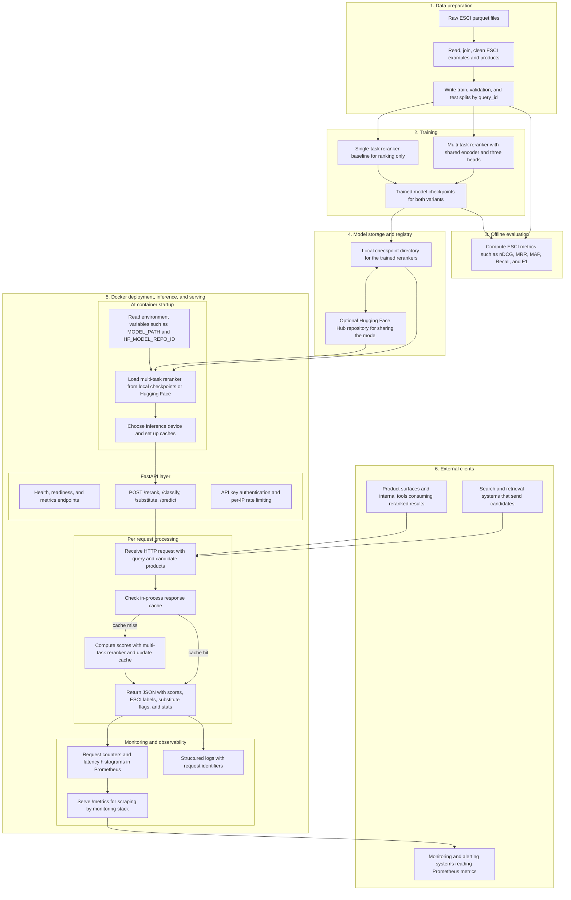

# **Amazon ESCI Multi-Task Search Reranker**

Multi-task learning cross-encoder for the [Amazon ESCI](https://github.com/amazon-science/esci-data) tasks. **ESCI** stands for **Exact**, **Substitute**, **Complement**, and **Irrelevant** – the four relevance labels used in the Shopping Queries Dataset. This repo focuses on ESCI **Task 1–3** (query–product ranking, 4-class ESCI prediction, and substitute detection). The main model is a **shared encoder with three heads** trained jointly:

- Task 1: regression to ESCI gain for ranking (nDCG-optimized).
- Task 2: 4-class E/S/C/I classification.
- Task 3: binary “is substitute?” prediction.

Trained on the [Shopping Queries Dataset](https://arxiv.org/abs/2206.06588) with combined losses. A single-task cross-encoder reranker for Task 1 is still available as a baseline. The repo includes data loading (train/val/test split by `query_id`), training with early stopping, evaluation (nDCG, MRR, MAP, Recall@k), and Python/API interfaces for scoring and reranking.

**Contents:** [Prediction problem](#prediction-problem) · [Architecture](#overall-architecture) · [Requirements](#requirements) · [Setup](#setup) · [How to use each component](#how-to-use-each-component) · [Data](#data) · [Pipeline](#pipeline) · [Training](#training) · [Results](#results) · [Inference](#inference) · [Troubleshooting](#troubleshooting) · [Project structure](#project-structure)

---

## Prediction Problem

- **Task:** Rank products for a search query so that the most relevant items appear at the top (ESCI Task 1).
- **Input:** A (query, product) pair. The query is the user's search string; the product is text (title, description, or both).
- **Output:** A scalar relevance score. Higher scores mean more relevant. Used to rerank a candidate list of products.
- **Train vs serve:** For **training**, each example is (query, product) with a target gain (E=1.0, S=0.1, C=0.01, I=0.0). For **serve and evaluation**, the model scores arbitrary (query, product) pairs and we rank by score.

### ESCI labels and gains

| Label | Meaning     | Gain (nDCG) |
| ----- | ----------- | ----------- |
| E     | Exact match | 1.0         |
| S     | Substitute  | 0.1         |
| C     | Complement  | 0.01        |
| I     | Irrelevant  | 0.0         |

Training uses MSE loss: the model predicts a scalar and is trained to match these gain values.

---

## Overall Architecture



The original single-task `CrossEncoderReranker` (Task 1 only) is still available and can be trained/evaluated separately.

---

## How this model could be used

- **Search reranking:** A retrieval stage (e.g. BM25, two-tower) returns candidates; the cross-encoder reranks them for final display.
- **Product search APIs:** Expose a `/rerank` endpoint: input = query + candidate product IDs/texts, output = top-k by score.
- **A/B testing:** Compare cross-encoder reranking vs no reranking or vs a simpler heuristic on click-through, add-to-cart, or conversion.
- **Batch precompute:** For popular queries, precompute top-k products and cache; refresh periodically as the model or catalog changes.

---

## Requirements

- **Python** 3.12+ (managed via `uv` or your environment).
- **Amazon ESCI dataset** from [amazon-science/esci-data](https://github.com/amazon-science/esci-data). Place parquets under `data/`.
- **Disk:** ~1–2 GB for raw data + processed splits; model checkpoints add ~100–200 MB.
- **Memory:** 8 GB RAM is enough for data prep and inference; training benefits from 16 GB+ and a GPU (CUDA or Apple MPS) for speed.

---

## Setup

1. **Clone or open the repo** and enter the project root.
2. **Install dependencies** (prefer `uv` for a locked environment):

```bash
 uv sync
```

Or with pip: `pip install -e .` (see `pyproject.toml` for dependencies). 3. **Download the Amazon ESCI parquets** into `data/`:

- `shopping_queries_dataset_products.parquet`
- `shopping_queries_dataset_examples.parquet`

4. **Materialize train/test splits:**

```bash
 uv run python -m src.data.load_data --save-splits
```

Writes `data/esci_train.parquet` and `data/esci_test.parquet`. 5. **Verify:** Run training (see [Pipeline](#pipeline)); it will fail with a clear error if any file is missing.

---

## How to use each component

| Component                     | Command / Usage                                                                                      | When to use                                                |
| ----------------------------- | ---------------------------------------------------------------------------------------------------- | ---------------------------------------------------------- |
| **Data prep**                 | `uv run python -m src.data.load_data --save-splits`                                                  | First step: write train/test parquets from raw.            |
| **Train (multi)**             | `uv run python -m src.training.train_multi_task_reranker --config configs/multi_task_reranker.yaml`  | Train the multi-task learning reranker (recommended).      |
| **Train (single)**            | `uv run python -m src.training.train_reranker --config configs/reranker.yaml`                        | Train single-task cross-encoder (Task 1 baseline).         |
| **Eval (single)**             | `uv run python -m src.eval.eval_reranker --config configs/reranker.yaml`                             | Standalone eval on test set for the single-task model.     |
| **Inference (multi, Python)** | `from src.models.multi_task_reranker import load_multi_task_reranker` → `predict()` / `rerank()`     | Score/rerank with multi-task outputs inside Python.        |
| **Inference (multi, CLI)**    | `uv run python -m src.inference.infer_multi_task_reranker --config configs/multi_task_reranker.yaml` | Sample test query with score, ESCI class, substitute prob. |
| **Inference (HTTP)**          | Run FastAPI (see API section) and call `POST /rerank`                                                | Production-style integration using the multi-task model.   |
| **Tests**                     | `uv run pytest tests/ -v`                                                                            | Run unit tests.                                            |

**Typical workflow (multi-task, default):** 1) Data prep → 2) Train multi-task → 3) (Optional) Train/eval single-task baseline → 4) Use `load_multi_task_reranker` in Python or the FastAPI `/rerank` endpoint.

---

## Data

### Input files (under `data/`)

| File                                          | Key columns                                                    | Role                                                     |
| --------------------------------------------- | -------------------------------------------------------------- | -------------------------------------------------------- |
| **shopping_queries_dataset_examples.parquet** | query_id, query, product_id, esci_label, split                 | Query–product pairs and ESCI labels; split = train/test. |
| **shopping_queries_dataset_products.parquet** | product_id, product_locale, product_title, product_description | Product metadata; merged with examples for full text.    |

### Data prep output

| Output                 | Description                        |
| ---------------------- | ---------------------------------- |
| **esci_train.parquet** | Training split (split == "train"). |
| **esci_test.parquet**  | Test split (split == "test").      |

`load_esci` adds `product_text` (title + description) for richer input. Use `product_title` for shorter, ESCI-exact style. **Task 1 (small_version):** Reduced set (~48k queries) for faster experiments.

### Train/val/test split (at training time)

- **Train:** 90% of training split, by query_id (no query in both train and val).
- **Validation:** 10% of training split; used for mid-training eval and early stopping.
- **Test:** Original test split; used only for final evaluation after training.

---

## Pipeline

### 1. Prepare

Reads the parquets, merges examples with products, and writes train/test parquets using the dataset's `split` column.

```bash
uv run python -m src.data.load_data --save-splits
```

### 2. Train (multi-task, default)

Loads train/val/test, builds a shared-encoder `MultiTaskReranker` with three heads, and trains with combined loss and validation every N steps. Saves the best checkpoint (by val nDCG on Task 1) to `checkpoints/multi_task_reranker`. Final test-set metrics are logged at the end (via the training script’s evaluation).

```bash
uv run python -m src.training.train_multi_task_reranker --config configs/multi_task_reranker.yaml
```

**Config:** Edit `configs/multi_task_reranker.yaml` for all settings (task weights, lr, batch size, early stopping, save_path). Use `--config path/to/other.yaml` to load a different config.

### 2b. Train and eval (single-task baseline, optional)

You can still train and evaluate the original single-task cross-encoder reranker:

```bash
uv run python -m src.training.train_reranker --config configs/reranker.yaml

uv run python -m src.eval.eval_reranker --config configs/reranker.yaml
```

### Commands

```bash
# 1. Prepare
uv run python -m src.data.load_data --save-splits

# 2. Train multi-task (recommended)
uv run python -m src.training.train_multi_task_reranker --config configs/multi_task_reranker.yaml

# (Optional) single-task training + eval
uv run python -m src.training.train_reranker --config configs/reranker.yaml
uv run python -m src.eval.eval_reranker --config configs/reranker.yaml

# Different single-task config
uv run python -m src.training.train_reranker --config configs/reranker_fast.yaml
```

---

## Training

- **Runtime:** On Apple Silicon (MPS), the multi-task model has similar per-step speed to the single-task cross-encoder, but each step is slightly heavier due to three heads and extra losses. One epoch (~78k steps) still takes several hours; CUDA GPUs are faster.
- **Hyperparameters (multi-task):** See `configs/multi_task_reranker.yaml` for task weights, learning rate, batch_size, warmup_steps, and early stopping (patience on nDCG for Task 1).
- **Hyperparameters (single-task):** Default `lr=7e-6`, `batch_size=16`, `warmup_steps=5000` in `configs/reranker.yaml`. Early stopping (patience=3) stops if val nDCG doesn't improve for 3 evals.
- **Checkpoints:** Multi-task best checkpoint by val nDCG saved to `checkpoints/multi_task_reranker`; single-task best checkpoint saved to `checkpoints/reranker`. Both scripts save via their respective `save()` APIs.

---

## Results

### Baseline (esci-data repo)

Official baselines from [amazon-science/esci-data](https://github.com/amazon-science/esci-data) (BERT-based models, fine-tuned per locale for Task 1; MLP classifier for Tasks 2/3):

| Task | Metrics            | Baseline   |
| ---- | ------------------ | ---------- |
| 1    | nDCG               | 0.83       |
| 2    | Macro F1, Micro F1 | 0.23, 0.62 |
| 3    | Macro F1, Micro F1 | 0.44, 0.76 |

### Multi-task model (test set)

Setup: default config (`configs/multi_task_reranker.yaml`). Test set evaluation on the full ESCI test split. All metrics beat the [official esci-data baselines](https://github.com/amazon-science/esci-data) above.

| Task                      | Metric    | Ours       | Baseline     |
| ------------------------- | --------- | ---------- | ------------ |
| **Task 1** (ranking)      | nDCG      | **0.9443** | 0.83         |
|                           | MRR       | 0.9840     | —            |
|                           | MAP       | 0.9620     | —            |
|                           | Recall@10 | 0.6133     | —            |
| **Task 2** (4-class ESCI) | Accuracy  | 0.7332     | —            |
|                           | Macro F1  | **0.5366** | 0.23         |
| **Task 3** (substitute)   | Accuracy  | 0.8115     | —            |
|                           | F1        | **0.5085** | 0.44 (macro) |

**What the metrics mean:** nDCG = normalized discounted cumulative gain with graded gains (E/S/C/I). MRR = mean reciprocal rank of first relevant item. MAP = mean average precision. Recall@10 = fraction of relevant items in top-10. All computed per query and averaged; higher is better.

Best checkpoint (by val nDCG) saved to `checkpoints/reranker` (single-task) or `checkpoints/multi_task_reranker` (multi-task). Final test-set metrics are logged at the end of training.

**Reproducibility:** Exact numbers depend on hardware, seed, and hyperparameters. Use the same config and flags to approximate these results.

---

## Inference

### Python API (multi-task model)

```python
from src.models.multi_task_reranker import load_multi_task_reranker

# Load from local checkpoint, or download from Hugging Face Hub if not found
mt_reranker = load_multi_task_reranker(model_path="checkpoints/multi_task_reranker")
# Or use a HF repo directly: load_multi_task_reranker(model_path="USERNAME/amazon-multitask-reranker")

# Score (query, product) pairs
pairs = [
    ["wireless bluetooth headphones", "Sony WH-1000XM4 Wireless Noise Cancelling Headphones"],
    ["wireless bluetooth headphones", "USB-C Cable 6ft"],
]
scores, esci_classes, substitute_probs = mt_reranker.predict(pairs)

# Rerank candidates for a single query
candidates = [
    ("prod_1", "Sony WH-1000XM4 Wireless Noise Cancelling Headphones"),
    ("prod_2", "USB-C Cable 6ft"),
]
ranked = mt_reranker.rerank("wireless bluetooth headphones", candidates)
# -> [(product_id, score, esci_class, substitute_prob), ...] sorted by score descending
```

### Python API (single-task baseline)

If you prefer the original single-task cross-encoder (Task 1 only):

```python
from src.models.reranker import load_reranker

reranker = load_reranker(model_path="checkpoints/reranker")

pairs = [
    ["wireless bluetooth headphones", "Sony WH-1000XM4 Wireless Noise Cancelling Headphones"],
    ["wireless bluetooth headphones", "USB-C Cable 6ft"],
]
scores = reranker.predict(pairs)
```

### CLI helper: sample inference on ESCI test set

There is a small script to inspect rankings on the ESCI **test** split:

```bash
uv run python -m src.inference.infer_reranker \
  --config configs/reranker.yaml \
  --query-index 0 \
  --top-k 5
```

- **Candidate products** are always taken from the ESCI **test set**: for the chosen `query_id`, all rows with that `query_id` become candidates.
- `query_index` selects which `query_id` to use (index over unique `query_id`s in the test set).
- You can override the query text while keeping the same candidate pool:
  ```bash
  uv run python -m src.inference.infer_reranker \
    --config configs/reranker.yaml \
    --query-index 0 \
    --query "screen privacy fence without holes"
  ```
  This is useful for quick experiments, but if your query is unrelated to that `query_id` and you do **not** also change the candidates, the ranking can look odd because the products themselves are mismatched to the query.

For real serving, you should:

1. Use your own retrieval stage (BM25, ANN, etc.) to build a candidate list for a user query.
2. Call `reranker.rerank(query, candidates)` from Python with those candidates, instead of relying on the ESCI test-set helper script.

### CLI helper: multi-task inference on ESCI test set

Same flow as above, but with the multi-task model (score, ESCI class, substitute probability):

```bash
uv run python -m src.inference.infer_multi_task_reranker \
  --config configs/multi_task_reranker.yaml \
  --query-index 0 \
  --top-k 5
```

- **Options:** `--query` (override query text), `--query-index` (index over unique query_ids), `--top-k` (number of results), `--config` (YAML path).
- Override the query while keeping the same candidate pool:
  ```bash
  uv run python -m src.inference.infer_multi_task_reranker \
    --config configs/multi_task_reranker.yaml \
    --query-index 0 \
    --query "screen privacy fence without holes"
  ```

Or use the Python API directly:

```python
from src.inference import MultiTaskRerankerInference
from src.constants import INFER_MULTI_TASK_DEFAULTS

cfg = {**INFER_MULTI_TASK_DEFAULTS, "query_index": 0, "top_k": 5}
MultiTaskRerankerInference(cfg).run()
```

### Example output

```
Top-5 reranked for "wireless bluetooth headphones":
  1. prod_1 (score=0.89) Sony WH-1000XM4 Wireless Noise Cancelling Headphones
  2. prod_2 (score=0.12) USB-C Cable 6ft
  ...
```

Multi-task output includes `[true=E pred=E] score=0.89 sub_prob=0.02` per product.

---

## Multi-task learning model

A multi-task learning variant trains one shared encoder with three heads for all ESCI tasks:

- **Task 1 (ranking):** Regression to ESCI gain; same nDCG evaluation.
- **Task 2 (4-class):** E/S/C/I classification (CrossEntropy).
- **Task 3 (substitute):** Binary “is substitute?” (BCE; label = 1 when ESCI = S).

Train with:

```bash
uv run python -m src.training.train_multi_task_reranker --config configs/multi_task_reranker.yaml
```

Config: `configs/multi_task_reranker.yaml` (task weights, lr, `save_path`, etc.). Checkpoint is saved to `checkpoints/multi_task_reranker` by default. The API exposes task-specific routes: `/rerank` (Task 1), `/classify` (Task 2), `/substitute` (Task 3), and `/predict` (all three combined).

### Upload to Hugging Face Hub

To share the trained model on the Hub:

```bash
# Login first (one-time). Use one of:
uv run hf auth login
# or: uv run python -c "from huggingface_hub import login; login()"

# Upload checkpoint
uv run python scripts/upload_to_huggingface.py --repo-id username/amazon-esci-reranker
```

Options: `--model-path` (default: `checkpoints/multi_task_reranker`), `--private`, `--commit-message`. Requires `huggingface_hub` (explicit dependency).

---

## API

A FastAPI service exposes the multi-task learning reranker for HTTP calls.

### Run locally

```bash
# From repo root. Model load order: local path → Hugging Face Hub → pretrained encoder (random heads).
export MODEL_PATH=checkpoints/multi_task_reranker
uv run uvicorn src.api.main:app --reload --host 0.0.0.0 --port 8000
```

**Model loading:** If `MODEL_PATH` does not exist locally, the app downloads from Hugging Face Hub (`HF_MODEL_REPO_ID` env or `{username}/amazon-multitask-reranker` when logged in). Set `HF_MODEL_REPO_ID=USERNAME/amazon-multitask-reranker` to use a specific repo, or `MODEL_PATH=USERNAME/amazon-multitask-reranker` to load directly from HF.

**Environment variables:**

| Variable           | Description                                                                                        |
| ------------------ | -------------------------------------------------------------------------------------------------- |
| `MODEL_PATH`       | Local path or HF repo ID for the reranker (default: `checkpoints/multi_task_reranker`).            |
| `HF_MODEL_REPO_ID` | Hugging Face repo for fallback download.                                                           |
| `INFERENCE_DEVICE` | Inference device override: `cuda`, `mps`, or `cpu` (default: auto-resolve `cuda` > `mps` > `cpu`). |
| `RATE_LIMIT`       | Per-IP rate limit (default: `100/minute`).                                                         |
| `API_KEY`          | When set, require this key on POST endpoints (`X-API-Key` or `Authorization: Bearer`).             |

### Endpoints

| Method | Path          | Description                                                        |
| ------ | ------------- | ------------------------------------------------------------------ |
| GET    | `/health`     | Liveness; returns `status` and `model_loaded` (rate-limit exempt). |
| GET    | `/ready`      | Readiness for k8s; `ready` or `not_ready` (rate-limit exempt).     |
| GET    | `/metrics`    | Prometheus metrics (rate-limit exempt).                            |
| POST   | `/rerank`     | Task 1: rank candidates by relevance score only.                   |
| POST   | `/classify`   | Task 2: ESCI class (E/S/C/I) per candidate.                        |
| POST   | `/substitute` | Task 3: substitute label (true/false) per candidate.               |
| POST   | `/predict`    | All tasks: score + ESCI + substitute, sorted by score.             |

### Monitoring and environment

- **Request logging:** Each request is logged with `path`, `method`, `status`, `request_id`, `latency_ms`. Responses include an `X-Request-ID` header (from request or generated).
- **Prometheus:** `GET /metrics` exposes counters (`*_requests_total` by status), histograms (`*_latency_seconds`), and gauge `model_loaded`. Use a custom registry (no process/GC metrics).
- **Rate limiting:** Per-IP; default `100/minute`. Override with `RATE_LIMIT` (e.g. `200/minute`). `/health`, `/ready`, `/metrics` are exempt.
- **API key (optional):** Set `API_KEY` to require `X-API-Key` or `Authorization: Bearer <key>` on POST endpoints. `/health`, `/ready`, `/metrics` are unauthenticated.
- **Response caching:** In-process LRU cache (size 256) on the shared `predict()` results keyed by `(query, candidate texts)`, reused across `/rerank`, `/classify`, `/substitute`, `/predict` when the same query + candidates are requested again.

### Request body (all POST endpoints)

```json
{
  "query": "wireless headphones",
  "candidates": [
    {
      "product_id": "p1",
      "text": "Sony WH-1000XM4 Wireless Noise Cancelling Headphones"
    },
    { "product_id": "p2", "text": "Bose QuietComfort 45 Bluetooth Headphones" }
  ]
}
```

- `query` (string): search query
- `candidates` (array): list of `{product_id, text}`; `text` is the product description/title to score

### Response examples

**GET /health**

```json
{ "status": "ok", "model_loaded": true }
```

**GET /ready**

```json
{ "status": "ready" }
```

Or `{"status": "not_ready"}` when the model is not loaded.

All POST responses include `request_id` (same as `X-Request-ID` header) and `stats` for tracing and debugging. Stats: `total_latency_ms`, `model_forward_time_ms`, `num_candidates`, `num_recommendations`, `device`, `top_score` / `avg_score` (rerank and predict only), `timestamp`.

**POST /rerank** – sorted by score descending

```json
{
  "request_id": "a1b2c3d4-e5f6-7890-abcd-ef1234567890",
  "ranked": [
    { "product_id": "p1", "score": 0.92 },
    { "product_id": "p2", "score": 0.78 }
  ],
  "stats": {
    "total_latency_ms": 45.2,
    "model_forward_time_ms": 38.0,
    "num_candidates": 2,
    "num_recommendations": 2,
    "device": "mps",
    "top_score": 0.92,
    "avg_score": 0.85,
    "timestamp": 1772490882.9
  }
}
```

**POST /classify** – same order as request

```json
{
  "request_id": "a1b2c3d4-e5f6-7890-abcd-ef1234567890",
  "results": [
    { "product_id": "p1", "esci_class": "E" },
    { "product_id": "p2", "esci_class": "S" }
  ],
  "stats": {
    "total_latency_ms": 38.1,
    "model_forward_time_ms": 32.0,
    "num_candidates": 2,
    "num_recommendations": 2,
    "device": "mps",
    "top_score": null,
    "avg_score": null,
    "timestamp": 1772490883.1
  }
}
```

ESCI: E=Exact, S=Substitute, C=Complement, I=Irrelevant.

**POST /substitute** – same order as request

```json
{
  "request_id": "a1b2c3d4-e5f6-7890-abcd-ef1234567890",
  "results": [
    { "product_id": "p1", "is_substitute": false },
    { "product_id": "p2", "is_substitute": true }
  ],
  "stats": {
    "total_latency_ms": 42.0,
    "model_forward_time_ms": 35.5,
    "num_candidates": 2,
    "num_recommendations": 2,
    "device": "mps",
    "top_score": null,
    "avg_score": null,
    "timestamp": 1772490883.2
  }
}
```

`is_substitute: true` when the product is a functional substitute (ESCI=S).

**POST /predict** – all outputs, sorted by score descending

```json
{
  "request_id": "a1b2c3d4-e5f6-7890-abcd-ef1234567890",
  "ranked": [
    {
      "product_id": "p1",
      "score": 0.92,
      "esci_class": "E",
      "is_substitute": false
    },
    {
      "product_id": "p2",
      "score": 0.78,
      "esci_class": "S",
      "is_substitute": true
    }
  ],
  "stats": {
    "total_latency_ms": 52.3,
    "model_forward_time_ms": 44.0,
    "num_candidates": 2,
    "num_recommendations": 2,
    "device": "mps",
    "top_score": 0.92,
    "avg_score": 0.85,
    "timestamp": 1772490883.3
  }
}
```

### curl examples

```bash
# Health check
curl http://localhost:8000/health
```

```json
{ "status": "ok", "model_loaded": true }
```

```bash
# Readiness (k8s)
curl http://localhost:8000/ready
```

```json
{ "status": "ready" }
```

```bash
# Prometheus metrics
curl http://localhost:8000/metrics
```

Example output (excerpt): `# HELP rerank_requests_total Total number of /rerank requests` and histogram/counter lines.

```bash
# Rerank (Task 1) – multiple candidates, returned sorted by score descending
curl -X POST http://localhost:8000/rerank \
  -H "Content-Type: application/json" \
  -d '{"query": "wireless headphones", "candidates": [{"product_id": "p1", "text": "Sony WH-1000XM4 Wireless Noise Cancelling Headphones"}, {"product_id": "p2", "text": "Bose QuietComfort 45 Bluetooth Headphones"}, {"product_id": "p3", "text": "USB-C Charging Cable 6ft"}]}'
```

```json
{
  "request_id": "a1b2c3d4-e5f6-7890-abcd-ef1234567890",
  "ranked": [
    { "product_id": "p1", "score": 0.92 },
    { "product_id": "p2", "score": 0.85 },
    { "product_id": "p3", "score": 0.12 }
  ],
  "stats": {
    "total_latency_ms": 48.5,
    "model_forward_time_ms": 42.0,
    "num_candidates": 3,
    "num_recommendations": 3,
    "top_score": 0.92,
    "avg_score": 0.63,
    "timestamp": 1772490882.9
  }
}
```

```bash
# Classify (Task 2)
curl -X POST http://localhost:8000/classify \
  -H "Content-Type: application/json" \
  -d '{"query": "wireless headphones", "candidates": [{"product_id": "p1", "text": "Sony WH-1000XM4"}]}'
```

```json
{
  "request_id": "a1b2c3d4-e5f6-7890-abcd-ef1234567890",
  "results": [{ "product_id": "p1", "esci_class": "E" }],
  "stats": {
    "total_latency_ms": 35.2,
    "model_forward_time_ms": 28.0,
    "num_candidates": 1,
    "num_recommendations": 1,
    "top_score": null,
    "avg_score": null,
    "timestamp": 1772490882.9
  }
}
```

```bash
# Substitute (Task 3)
curl -X POST http://localhost:8000/substitute \
  -H "Content-Type: application/json" \
  -d '{"query": "wireless headphones", "candidates": [{"product_id": "p1", "text": "Sony WH-1000XM4"}]}'
```

```json
{
  "request_id": "a1b2c3d4-e5f6-7890-abcd-ef1234567890",
  "results": [{ "product_id": "p1", "is_substitute": false }],
  "stats": {
    "total_latency_ms": 33.1,
    "model_forward_time_ms": 26.5,
    "num_candidates": 1,
    "num_recommendations": 1,
    "top_score": null,
    "avg_score": null,
    "timestamp": 1772490882.9
  }
}
```

```bash
# Predict (all tasks) – multiple candidates, returned sorted by score descending
curl -X POST http://localhost:8000/predict \
  -H "Content-Type: application/json" \
  -d '{"query": "wireless headphones", "candidates": [{"product_id": "p1", "text": "Sony WH-1000XM4 Wireless Noise Cancelling Headphones"}, {"product_id": "p2", "text": "Bose QuietComfort 45 Bluetooth Headphones"}, {"product_id": "p3", "text": "USB-C Charging Cable 6ft"}]}'
```

```json
{
  "request_id": "a1b2c3d4-e5f6-7890-abcd-ef1234567890",
  "ranked": [
    {
      "product_id": "p1",
      "score": 0.92,
      "esci_class": "E",
      "is_substitute": false
    },
    {
      "product_id": "p2",
      "score": 0.85,
      "esci_class": "E",
      "is_substitute": false
    },
    {
      "product_id": "p3",
      "score": 0.12,
      "esci_class": "I",
      "is_substitute": false
    }
  ],
  "stats": {
    "total_latency_ms": 55.0,
    "model_forward_time_ms": 48.0,
    "num_candidates": 3,
    "num_recommendations": 3,
    "top_score": 0.92,
    "avg_score": 0.63,
    "timestamp": 1772490882.9
  }
}
```

---

## Docker

Build and run the API in a container:

```bash
# Build (from repo root).
docker build -t esci-reranker-api .

# Run with model mounted from host (train multi-task learning first so checkpoints/multi_task_reranker exists).
docker run -p 8000:8000 -v "$(pwd)/checkpoints/multi_task_reranker:/app/checkpoints/multi_task_reranker:ro" -e MODEL_PATH=/app/checkpoints/multi_task_reranker esci-reranker-api

# Or use a model from Hugging Face Hub (no local checkpoint needed; requires HF token for private repos).
docker run -p 8000:8000 -e MODEL_PATH=USERNAME/amazon-multitask-reranker -e HF_TOKEN=your_token esci-reranker-api
```

Or use docker-compose:

```bash
docker compose up --build
```

The container serves the app on port 8000. Set `MODEL_PATH` (and optionally `HF_MODEL_REPO_ID`, `MODEL_NAME`, `RATE_LIMIT`, `API_KEY`) via env or compose. If the local path is empty, the app downloads the multi-task reranker from Hugging Face Hub (when `HF_MODEL_REPO_ID` is set or you are logged in) or falls back to the pretrained encoder with random heads.

---

## Troubleshooting

| Issue                    | Fix                                                                                                                                                                     |
| ------------------------ | ----------------------------------------------------------------------------------------------------------------------------------------------------------------------- |
| `model_loaded: false`    | Train first so `checkpoints/multi_task_reranker` exists, or set `MODEL_PATH=USERNAME/amazon-multitask-reranker` and `hf auth login`. Check server logs for load errors. |
| MPS OOM on Apple Silicon | Add `device: cpu` to config or reduce `batch_size` to 8.                                                                                                                |
| Slow eval                | Set `eval_max_queries: 1000` in config or increase `evaluation_steps`.                                                                                                  |

---

## Tests

```bash
uv run pytest tests/ -v
```

Tests cover constants, ESCI evaluator, data utils, and load_data (ESCIDataLoader).

---

## Project structure

| Path                                           | Description                                                                                              |
| ---------------------------------------------- | -------------------------------------------------------------------------------------------------------- |
| **configs/reranker.yaml**                      | Training config: model, batch_size, lr, evaluation_steps, early_stopping, val_frac, save_path.           |
| **configs/multi_task_reranker.yaml**           | Multi-task learning training: task weights, save_path (checkpoints/multi_task_reranker), lr, batch_size. |
| **src/api/main.py**                            | FastAPI app; lifespan, middleware (logging), rate limit, GET /ready, GET /metrics.                       |
| **src/api/routes.py**                          | GET /health, POST /rerank, /classify, /substitute, /predict (metrics + optional API key).                |
| **src/api/schemas.py**                         | Pydantic request/response models (RerankRequest, RerankResponse, etc.).                                  |
| **src/api/deps.py**                            | Model instance and path resolution (MODEL_PATH, HF_MODEL_REPO_ID env).                                   |
| **src/api/metrics.py**                         | Prometheus registry, counters, histograms, model_loaded gauge.                                           |
| **src/api/auth.py**                            | Optional API key verification (X-API-Key or Authorization: Bearer).                                      |
| **src/api/limiter.py**                         | Per-IP rate limiter (RATE_LIMIT env).                                                                    |
| **src/constants.py**                           | ESCI gains, ESCI_LABEL2ID, DATA_DIR, MODEL_CACHE_DIR, DEFAULT_RERANKER_MODEL.                            |
| **src/data/load_data.py**                      | ESCIDataLoader: load_esci, prepare_train_test, prepare_train_val_test (split by query_id).               |
| **src/data/utils.py**                          | Product text expansion (get_product_expanded_text).                                                      |
| **src/eval/evaluator.py**                      | ESCIMetricsEvaluator, compute_query_metrics (nDCG, MRR, MAP, Recall@k).                                  |
| **src/eval/eval_reranker.py**                  | Standalone eval script: load model, run on test set, print metrics.                                      |
| **src/models/reranker.py**                     | CrossEncoderReranker, load_reranker, predict(), rerank().                                                |
| **src/models/multi_task_reranker.py**          | MultiTaskReranker (ranking + 4-class + substitute), load_multi_task_reranker(), save/load.               |
| **src/training/train_reranker.py**             | Training entrypoint: load data, fit CrossEncoder (Task 1), final test eval.                              |
| **src/training/train_multi_task_reranker.py**  | Multi-task learning training: combined loss, Task 1/2/3, save to checkpoints/multi_task_reranker.        |
| **src/training/early_stopping.py**             | EarlyStoppingCallback (patience on nDCG).                                                                |
| **src/inference/infer_reranker.py**            | RerankerInference: CLI for single-task reranker on test set.                                             |
| **src/inference/infer_multi_task_reranker.py** | MultiTaskRerankerInference: CLI for multi-task reranker (score, ESCI, substitute).                       |
| **scripts/upload_to_huggingface.py**           | Upload checkpoint to Hugging Face Hub (--repo-id, --private, etc.).                                      |
| **tests/**                                     | test_constants, test_evaluator, test_data_utils, test_load_data.                                         |
| **notebooks/**                                 | load_data, train_reranker, inference_reranker.                                                           |
| **Dockerfile**, **docker-compose.yml**         | Container build and run for the API service.                                                             |
| **pyproject.toml**, **uv.lock**                | Project and dependency lock (uv).                                                                        |

---

## License

MIT. Use of the Amazon ESCI dataset is subject to its own terms.
